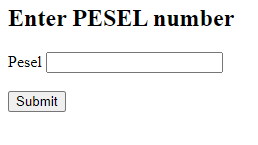
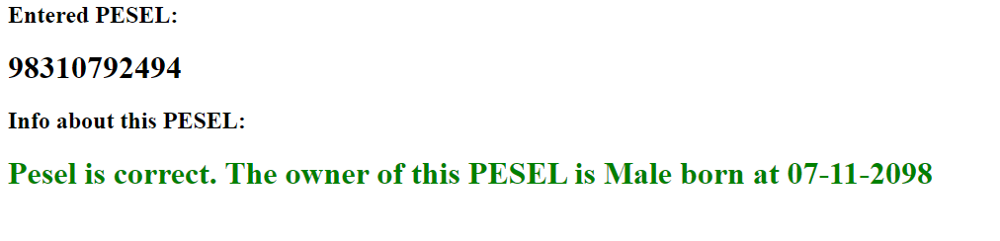
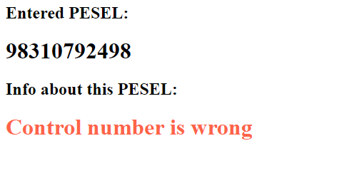
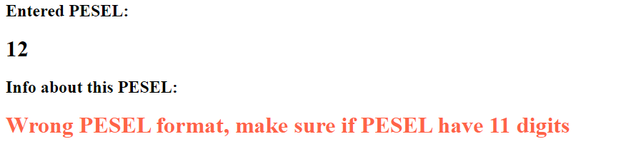
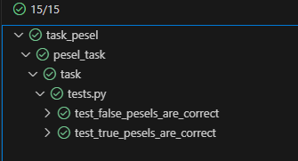

This application is being developed as a recruitment task.
PESEL via wikipedia: 'Universal Electronic System for Registration of the Population' is the national identification number used in Poland since 1979. The number is 11 digits long, identifies exactly one person, and cannot be changed once assigned, except in specific situations.
App is anable to check correctness of PESEL number, and provide feedback about incorrect or correct PESEL with information of gender and birth date. 

# Installation:
1. Clone this repository.
2. Contact with me for SECRET_KEY.
3. Install requirements: <code>pip install -r requirements.txt</code>
4. Go to pesel_task folder in terminal.
5. Enter <code>python manage.py runserver</code> in terminal.

# You can also run app in container:
1. Clone this repository.
2. Contact with me for SECRET_KEY.
3. Type <code> docker build -t pesel .</code> in terminal.
4. Type <code> docker run -d -p 8000:8000 --name pesel pesel </code> in terminal.

# How to use:
1. Visit <code>http://127.0.0.1:8000/</code>
2. Enter Pesel:

3. Wait for result: (PESEL from generator: https://pesel.cstudios.pl/o-generatorze/generator-on-line)

correct:

or for incorrect PESEL:

# Run tests:
1. Go to pesel_task folder in terminal.
2. Type <code>pytest</code>

